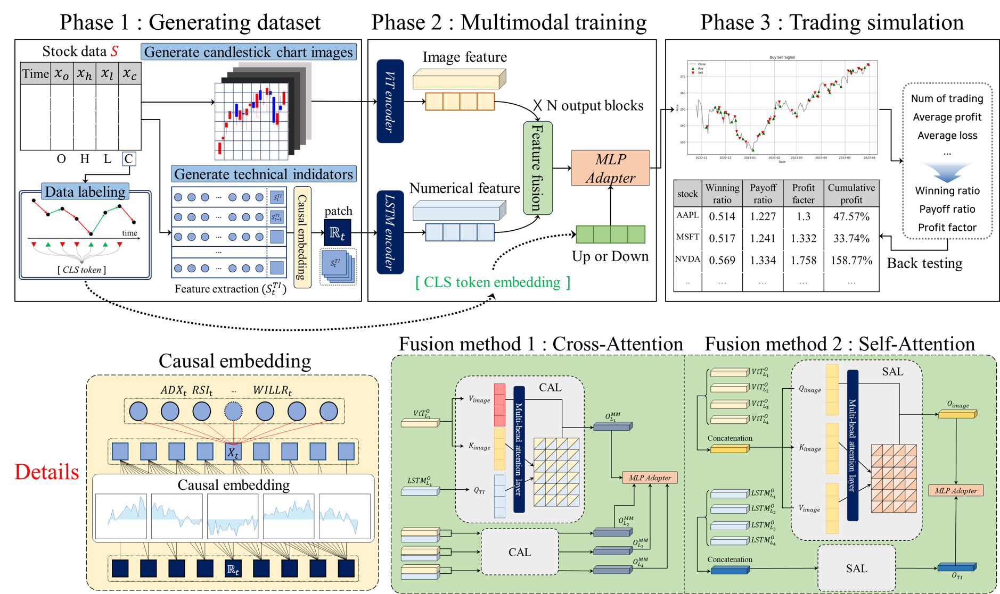
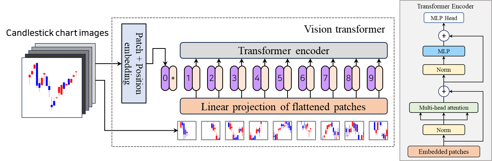
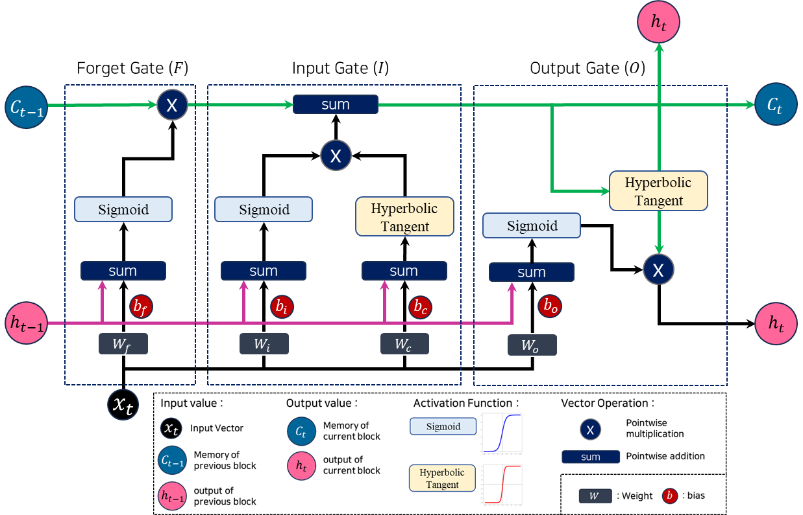
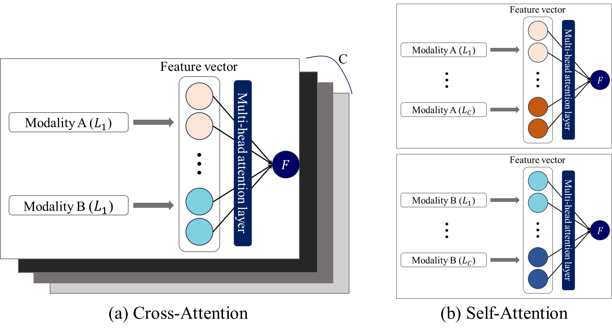
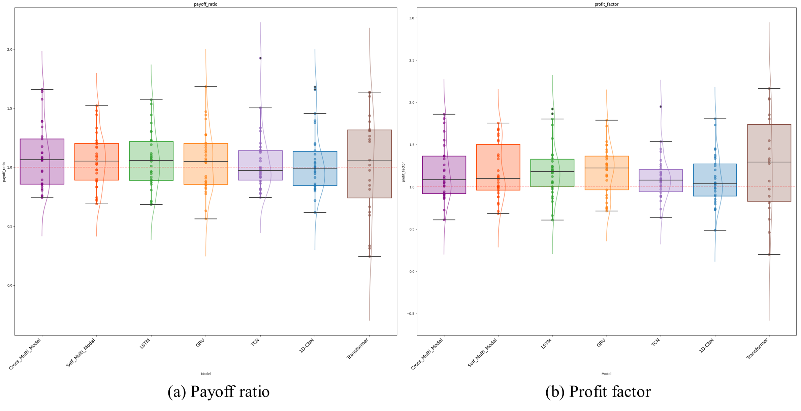
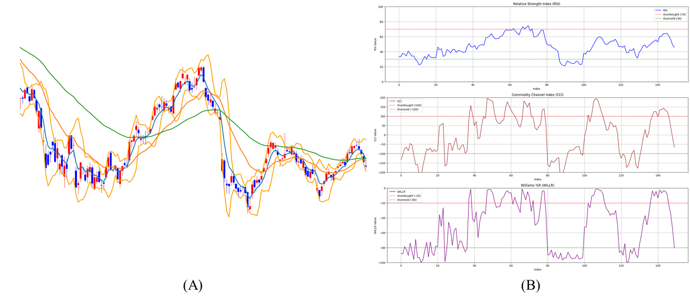
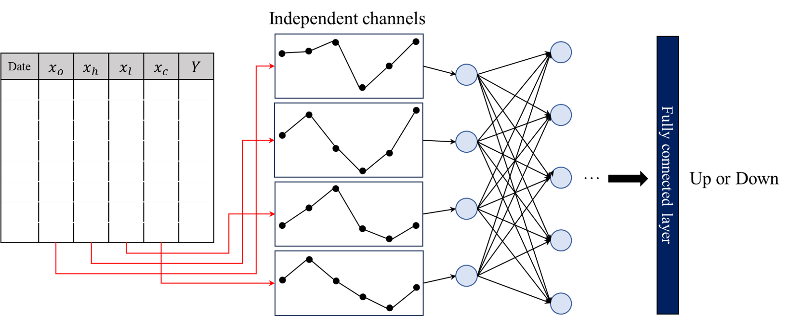
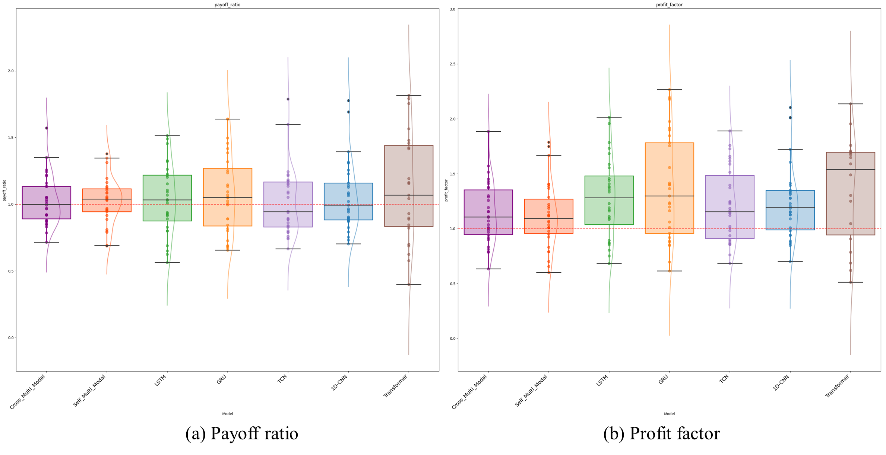
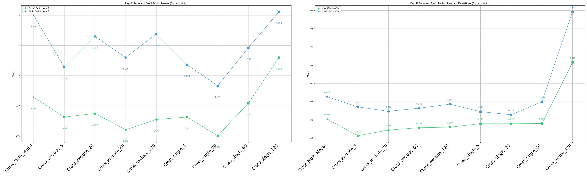

# Multimodal-TVD
Multimodal learning model for stock trading using technical-visual data

## Concept of proposed trading system


- **Numeric Modal** : Technical indicator (Momentum)
- **Visual Modal** : Candlestick chart images 

**Multimodal trading system - TVD**



**Multimodal Fusion method**



## 🛠 System
- **CPU** `AMD Ryzen 9 5950X 16-Core Processor`
- **GPU** `NVIDIA GeForce RTX 4080`
- **Memory RAM** `128GB`

**The computational efficiency of PAST is proportional to the CPU's power(Logical processor)**

## 📑 Usage
### Requirments
- **python version** `3.8`
- **TA Library** `TA_Lib-0.4.24-cp38-cp38-win_amd64.whl`
- **Other packages** `Packages in common_imports.py`

### run.py for data preparing & backtesting
- To run the system, the parser arguments must be passed using the `run.py` and `sh files`
- The `sh file` is divided into subfolders and multiple steps within the ./scripts/ folder.

#### The scripts folder structure is as follows:
```
./scripts/
├── scripts/
│     ├──01_data_download.sh
│     ├──02_candlestick_img.sh
│     ├──03_numeric_modal.sh
│     └──04_candlestick_img.sh

```

#### Example command (Git Bash)
```
sh ./scripts/data/04_backtesting.sh
```
#### Example code in sh file
```
#!/bin/bash
python run.py \
    --task_name backtesting \
    --bt_name BacktestSummary
```

## 📊 Multimodal-TVD Execution
### data




## 📈 Backtesting 📉


#### trading metric (mean, std)
- **PR : payoff ratio**
- **PF : profit factor**
- **CR : Cumulative return (%)**
- **MDD : MaxDrawdown (%)**

| Model | Number of trades<br>Mean | Std | Win rate | Payoff ratio<br>Mean | Std | Profit factor<br>Mean | Std | CR (%) | MDD (%) |
|:------|-------------------------:|----:|:---------:|---------------------:|----:|-----------------------:|----:|-------:|--------:|
| **Fusion A** | **79.833** | 15.559 | 0.643 | 0.864 | 0.278 | 1.555 | 0.45 | 54.307 | -30.371 |
| Fusion A (5) | 73.767 | 20.587 | 0.639 | 0.721 | 0.382 | 1.382 | 0.53 | 49.345 | -36.656 |
| Fusion A (20) | 46.533 | 15.154 | 0.634 | 0.843 | 0.248 | 1.541 | 0.46 | 36.407 | -40.169 |
| Fusion A (60) | 128.133 | 42.711 | 0.548 | 1.008 | 0.233 | 1.254 | 0.455 | 24.417 | -40.169 |
| Fusion A (120) | 103.933 | 36.861 | 0.533 | 0.711 | 0.243 | 1.222 | 0.45 | 37.938 | -37.398 |
| **Fusion B** | **86.033** | 22.035 | 0.626 | 0.914 | 0.242 | 1.576 | 0.36 | 55.752 | -33.056 |
| Fusion B (TI) | 16.033 | 4.033 | 0.734 | 0.889 | 0.188 | 3.136 | 3.956 | **68.34** | **-26.238** |
| Fusion B (IMG) | 81.667 | 9.151 | 0.632 | 0.78 | 0.177 | 1.369 | 0.422 | 42.753 | -37.515 |
| **Fusion A** | **57.367** | 16.228 | 0.667 | 0.866 | 0.315 | 1.795 | 0.847 | 48.311 | -30.524 |
| Fusion A (5) | 35.433 | 13.069 | 0.684 | 0.772 | 0.249 | 1.787 | 0.654 | 44.379 | -28.456 |
| Fusion A (20) | 34.367 | 11.947 | 0.569 | 0.884 | 0.274 | 1.996 | 0.47 | 36.497 | -32.938 |
| Fusion A (60) | 68.24 | 26.449 | 0.569 | 1.012 | 0.349 | 1.349 | 0.662 | 25.614 | -34.666 |
| Fusion A (120) | 43.433 | 35.852 | 0.558 | 1.049 | 0.376 | 1.352 | 0.49 | 34.324 | -33.93 |
| **Fusion B** | **59.667** | 23.46 | 0.675 | 0.736 | 0.232 | 2.539 | 2.84 | **58.606** | -27.442 |
| Fusion B (TI) | 15.067 | 4.456 | 0.751 | 0.76 | 0.135 | **3.626** | 3.236 | 31.944 | **-22.28** |
| Fusion B (IMG) | 76.867 | 6.699 | 0.637 | 0.758 | 0.167 | 1.352 | 0.384 | 36.69 | -38.124 |
| **Buy-and-Hold** | – | – | 0.517 | 0.978 | 0.06 | 1.052 | 0.084 | 29.356 | -53.42 |

**Note1**: ↑Up-down labeling, ↓Trend labeling
**Note2**: The best results for each indicator by labeling method are highlighted in **bold**
**Note3**: Wilcoxon test for pair-wise comparisons between models and benchmarks (*: p<0.05, †: 0.05≤p<0.1, blank: 0.1≤p)


#### trading plot


#### XAI

