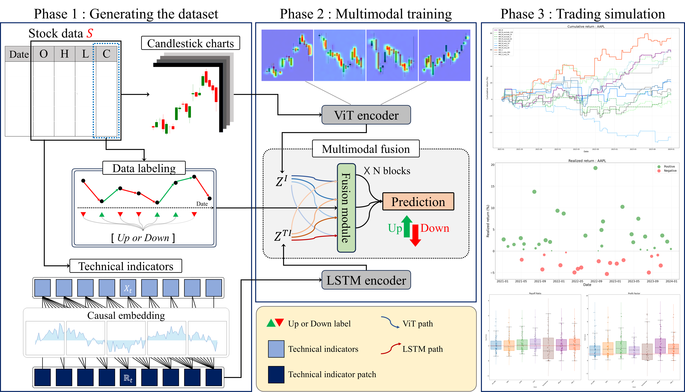
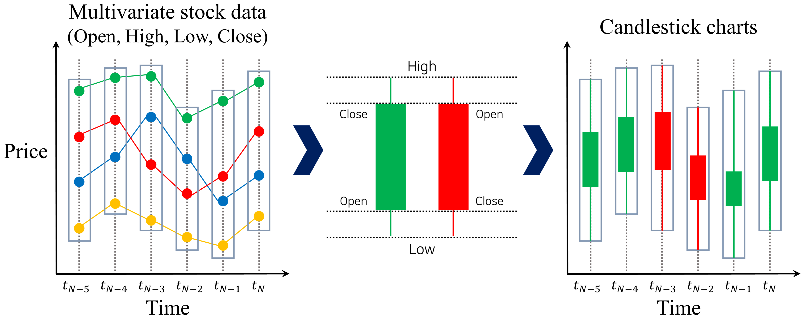
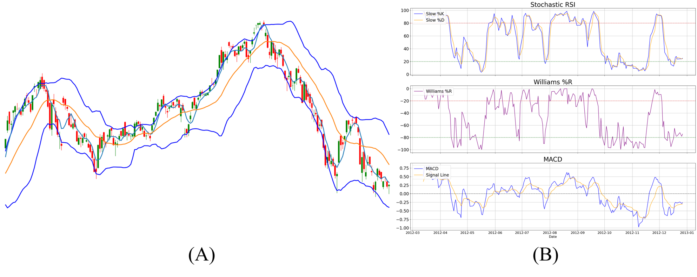
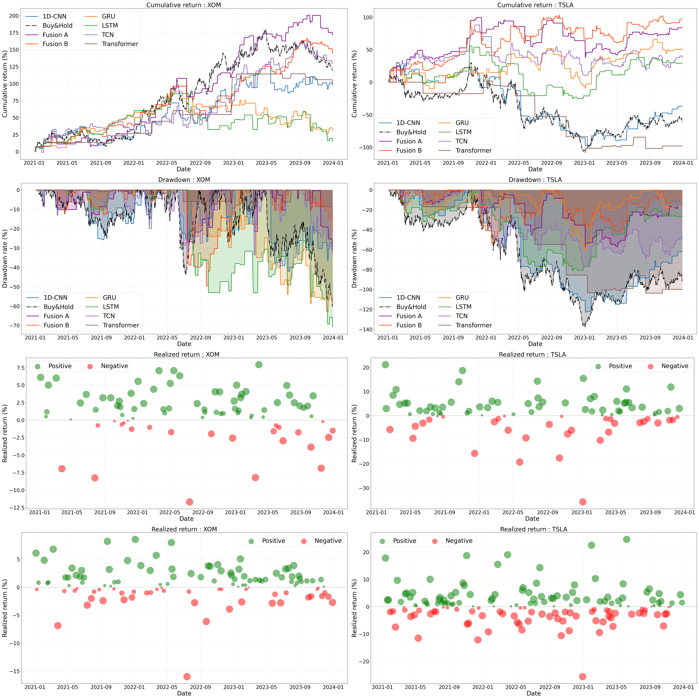
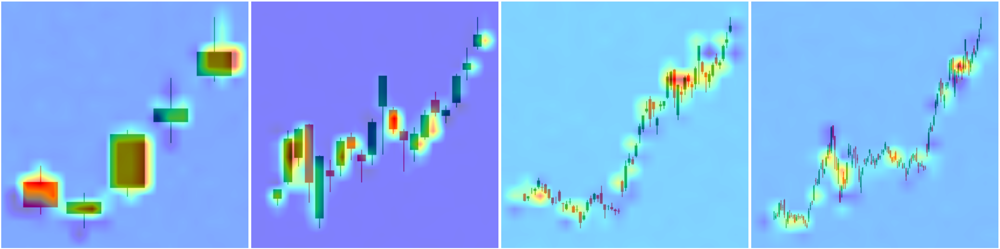
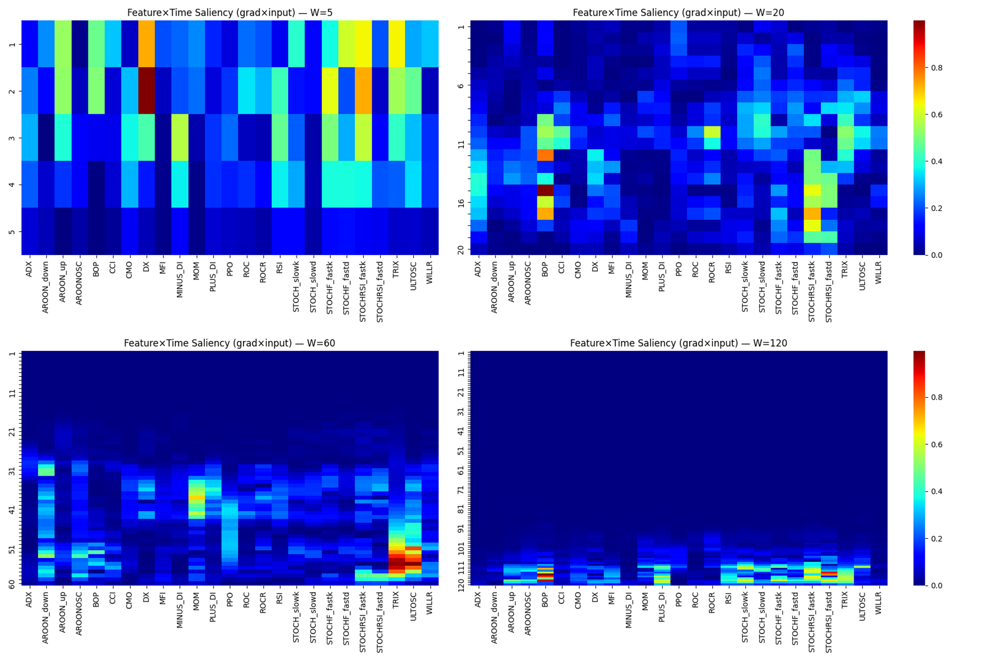

# Multimodal-TVD
Multimodal learning model for stock trading using technical-visual data

## Concept of proposed trading system


- **Numeric Modal** : Technical indicator (Momentum)
- **Visual Modal** : Candlestick chart images 

## 🛠 System
- **CPU** `AMD Ryzen 9 5950X 16-Core Processor`
- **GPU** `NVIDIA GeForce RTX 4080`
- **Memory RAM** `128GB`

**The computational efficiency of Multimodal-TVD is proportional to the CPU's power(Logical processor)**

## 📑 Usage
### Requirments
- **python version** `3.8`
- **TA Library** `TA_Lib-0.4.24-cp38-cp38-win_amd64.whl`
- **Other packages** `Packages in common_imports.py`

### run.py for data preparing & backtesting
- To run the system, the parser arguments must be passed using the `run.py` and `sh files`
- The `sh file` is divided into subfolders and multiple steps within the ./scripts/ folder.

#### The scripts folder structure is as follows:
```
./scripts/
├── scripts/
│     ├──01_data_download.sh
│     ├──02_candlestick_img.sh
│     ├──03_numeric_modal.sh
│     └──04_candlestick_img.sh

```

#### Example command (Git Bash)
```
sh ./scripts/data/04_backtesting.sh
```
#### Example code in sh file
```
#!/bin/bash
python run.py \
    --task_name backtesting \
    --bt_name BacktestSummary
```

## 📊 Multimodal-TVD data 
### Candlestick chart images 


### Technical indicators 



## 📈 Backtesting 📉

#### trading metric (mean, std)
- **PR : payoff ratio**
- **PF : profit factor**
- **CR : Cumulative return (%)**
- **MDD : MaxDrawdown (%)**

| Model | Number of trades | Win rate | Payoff ratio | Profit factor | CR (%) | MDD (%) |
|:------|-----------------:|---------:|--------------:|--------------:|-------:|--------:|
| **Fusion A (ver.1)** | 79.833 | 0.643 | 0.864 | 1.555 | 54.307 | -30.371 |
| Fusion A (5) | 73.767 | 0.633 | 0.792 | 1.382 | 36.450 | -36.566 |
| Fusion A (20) | 46.533 | 0.634 | 0.831 | 1.541 | 29.515 | -34.886 |
| Fusion A (60) | 128.133 | 0.548 | 1.008 | 1.254 | 24.417 | -40.169 |
| Fusion A (120) | 129.033 | 0.533 | 1.071 | 1.222 | 30.615 | -37.988 |
| **Fusion B (ver.1)** | 86.033 | 0.626 | 0.914 | 1.576 | 55.754 | -31.305 |
| Fusion B (TI) | 16.033 | 0.734 | 0.889 | 3.136 | 30.475 | -26.238 |
| Fusion B (IMG) | 81.667 | 0.632 | 0.780 | 1.369 | 42.753 | -37.515 |
| **Fusion A (ver.2)** | 57.367 | 0.667 | 0.866 | 1.795 | 48.314 | -30.524 |
| Fusion A (5) | 35.433 | 0.684 | 0.770 | 1.749 | 31.929 | -28.843 |
| Fusion A (20) | 34.367 | 0.687 | 0.838 | 1.996 | 36.474 | -32.938 |
| Fusion A (60) | 68.200 | 0.569 | 1.012 | 1.349 | 25.610 | -34.666 |
| Fusion A (120) | 83.433 | 0.558 | 1.049 | 1.335 | 28.090 | -34.398 |
| **Fusion B (ver.2)** | 59.667 | 0.675 | 1.080 | 2.589 | 58.606 | -27.481 |
| Fusion B (TI) | 15.067 | 0.751 | 0.937 | 3.626 | 31.940 | -22.280 |
| Fusion B (IMG) | 76.867 | 0.637 | 0.758 | 1.352 | 36.039 | -38.124 |
| **Buy-and-Hold** | - | 0.517 | 0.978 | 1.052 | 29.356 | -53.420 |

- **Note1**: ver.1: Up-down labeling, ver.2: Trend labeling
- **Note2**: The best results for each indicator by labeling method are highlighted in **bold**


## trading plot


## XAI (Candlestick chart images)


## XAI (Technical indicators)
