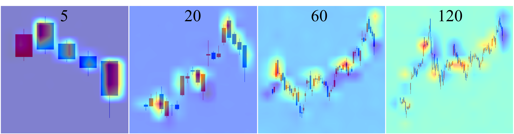
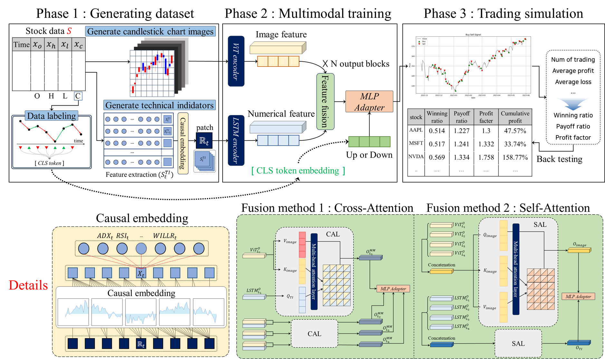
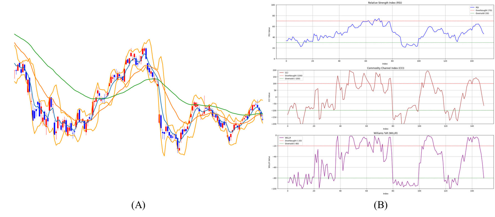
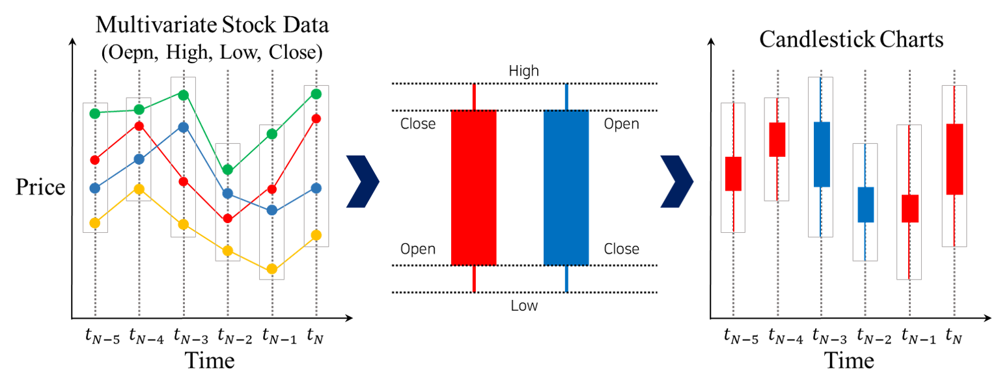

# Multimodal-TVD

**Multimodal trading system - TVD**


## Concept of proposed trading system


- **Modality A** : Technical indicator (Momentum)
- **Modality B** : Candlestick chart images 

## 🛠 System
- **CPU** `AMD Ryzen 9 5950X 16-Core Processor`
- **GPU** `NVIDIA GeForce RTX 4080`
- **Memory RAM** `128GB`

**The computational efficiency of PAST is proportional to the CPU's power(Logical processor)**

## 📑 Usage
### Requirments
- **python version** `3.8`
- **TA Library** `TA_Lib-0.4.24-cp38-cp38-win_amd64.whl`
- **Other packages** `Packages in common_imports.py`
- **Futures Data** `KOSPI200 Futures Data` 1-minute high-frequency trading data

### run.py for data preparing & backtesting
- To run the PAST system, the parser arguments must be passed using the `run.py` and `sh files`
- The `sh file` is divided into subfolders and multiple steps within the ./scripts/ folder.

#### The scripts folder structure is as follows:
```
./scripts/
├── data/
│     ├──01_data_preprocessing.sh
│     ├──02_TA_and_label.sh
│     └──03_candlestick_img.sh
│
└── Backtesting/
      ├──01_up_down_signal.sh
      ├──02_buy_sell_signal.sh
      │         :
```

#### Example command (Git Bash)
```
sh ./scripts/data/03_candlestick_image.sh
```
#### Example code in sh file
```
#!/bin/bash
python run.py \
    --task_name TA_label \
    --output_dir ./data/candle_img \
    --stock_codes AAPL MSFT NVDA GOOG AMZN BRK-B LLY AVGO TSLA JPM WMT UNH V XOM MA PG COST JNJ ORCL HD BAC KO NFLX MRK CVX CRM ADBE AMD PEP TMO \
    --seq_lens 5 20 60 120
```




## 📈 Backtesting 📉
#### trading metric (mean, std)
- **PR : payoff ratio**
- **PF : profit factor**
- **CR : Cumulative return (%)**
- **MDD : MaxDrawdown (%)**

| **Fusion_method** | **Model**       | **No. Trade Mean** | **Std** | **Winning Ratio** | **Payoff Ratio Mean** | **Std** | **Profit Factor Mean** | **Std** | **CR (%)** | 
|-------------------|-----------------|--------------------|---------|-------------------|-----------------------|---------|------------------------|---------|------------|
|                   | **ALL**         | **100.267**^†      | **23.27**^† | **0.524**^†       | **1.114**^†           | **0.305**^† | **1.25**^†            | **0.427**^† | **30.546**^† |
|                   | single 5^th     | 91.3^†             | 10.021^†    | 0.517^†           | 1.081^†               | 0.279^†     | 1.168^†               | 0.345^†     | 22.724^†     |
| **Cross**         | single 20^th    | 118.833^†          | 49.237^†    | 0.516^†           | 1.05^†                | 0.279^†     | 1.133^†               | 0.328^†     | 16.991^†     |
|                   | single 60^th    | 135.3^†            | 50.96^†     | 0.516^†           | 1.104^†               | 0.294^†     | 1.196^†               | 0.399^†     | 17.217^†     |
|                   | single 120^th   | 119.1^†            | 45.148^†    | 0.505^†           | 1.18^†                | 0.151^†     | 1.256^†               | 0.893^†     | 14.102^†     |
|                   | **ALL**         | **88.567**^†       | **14.755**^† | **0.524**^†      | **1.061**^†           | **0.225**^† | **1.186**^†           | **0.326**^† | **22.481**^† |
|                   | Only TII^MG     | 94.6^†             | 54.111^†    | 0.533^†           | 1.045^†               | 0.341^†     | 1.176^†               | 0.337^†     | 16.384^†     |
| **Self**          | Only IMG^+      | 101.867^†          | 22.254^†    | 0.523^†           | 1.052^†               | 0.221^†     | 1.178^†               | 0.376^†     | 22.295^†     |
|                   | **ALL**         | **97.833**^†       | **17.866**^† | **0.523**^†      | **1.025**^†           | **0.185**^† | **1.143**^†           | **0.208**^† | **22.247**^† |
|                   | single 5^th     | 90.967^†           | 17.556^†    | 0.516^†           | 1.055^†               | 0.291^†     | 1.122^†               | 0.271^†     | 17.176^†     |
| **Cross**         | single 20^th    | 130.4^†            | 49.029^†    | 0.514^†           | 1.067^†               | 0.219^†     | 1.136^†               | 0.262^†     | 19.236^†     |
|                   | single 60^th    | 106.567^†          | 41.046^†    | 0.512^†           | 1.108^†               | 0.239^†     | 1.186^†               | 0.431^†     | 18.812^†     |
|                   | single 120^th   | 122.133^†          | 42.697^†    | 0.521^†           | 1.16^†                | 0.787^†     | 1.607^†               | 2.884^†     | 19.123^†     |
|                   | **ALL**         | **93.1**^†         | **16.647**^† | **0.512**^†      | **1.053**^†           | **0.238**^† | **1.129**^†           | **0.298**^† | **18.902**^† |
| **Self**          | Only TII^       | 72.233^†           | 53.595^†    | 0.519^†           | 1.187^†               | 0.384^†     | 1.298^†               | 0.464^†     | 27.054^†     |
|                   | Only IMG^+      | 109.133^†          | 18.803^†    | 0.519^†           | 1.059^†               | 0.204^†     | 1.111^†               | 0.254^†     | 15.93^†      |

**Note:** ^†Up & down labeling, ^‡Trend labeling; 
**THE BEST RESULTS FOR EACH INDICATOR ARE HIGHLIGHTED IN BOLD**, and the next best are underlined^_.